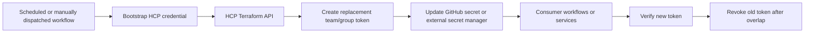
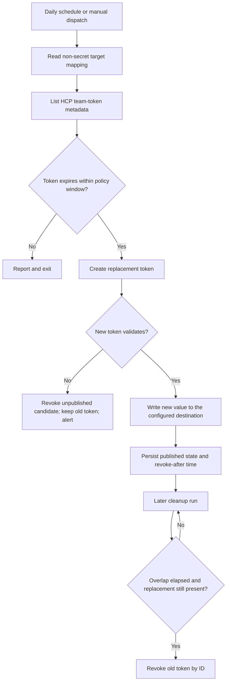

# HCP Terraform Token Rotation Automation — Discovery

**Date:** 2026-08-17  
**Phase:** Discovery  
**Scope assumption:** The customer has no Vault and does not plan to introduce one.

## Executive summary

The supplied workspace is an empty Git repository: there are no commits, remotes, source files, configuration files, CI definitions, documentation, or customer exports to inspect. There is therefore no existing token-rotation implementation in this workspace.

HCP Terraform exposes the lifecycle operations needed for automation through its API and the official `hashicorp/tfe` provider. The important design distinction is token type:

- Current team-token APIs support multiple valid tokens per team. This enables a create → distribute → verify → revoke sequence with an overlap window.
- Organization tokens have only one valid token at a time; creating a replacement invalidates the existing token. They are also intended for organization administration and cannot start runs or create configuration versions.
- User tokens are tied to a person and inherit that person’s permissions. They should not be the default identity for unattended automation.

Without Vault, the solution still needs two separate capabilities outside HCP Terraform: a scheduled execution environment and an approved secret store. HCP Terraform can create and revoke tokens, but it does not provide the end-to-end distribution and consumer-update workflow required for rotation.

## 1. Current-state findings

### Evidence in the workspace

| Area | Finding |
|---|---|
| Repository | Git repository exists on `main` |
| History | No commits |
| Remotes | None configured |
| Application code | None |
| Infrastructure as code | None |
| CI/CD or scheduled jobs | None |
| Secret-management integration | None |
| HCP Terraform inventory/configuration | None |

### Not yet known about the customer environment

We do not yet know which HCP Terraform organizations, teams/groups, workspaces, editions, regions, token types, consumers, or secret stores are in scope. We also do not know whether the customer already uses Terraform to manage HCP Terraform itself.

### Customer-provided team-token snapshot

The screenshot supplied on **2026-08-18** shows six team tokens. Names, descriptions, and creators are redacted, so the rows below are intentionally indexed rather than named. Days remaining are calculated from the screenshot date and should be recalculated from the API using the exact UTC expiry timestamp before acting.

| Token | Expiry date | Approx. days remaining | Last used shown | Provisional status |
|---|---:|---:|---|---|
| 1 | 2026-09-02 | 15 | 2 months ago | Rotate/prepare immediately |
| 2 | 2026-09-21 | 34 | Unused | Next candidate; confirm whether still needed |
| 3 | 2026-10-08 | 51 | A month ago | Monitor |
| 4 | 2026-10-19 | 62 | A month ago | Monitor |
| 5 | 2026-10-20 | 63 | A month ago | Monitor |
| 6 | 2026-10-28 | 71 | 13 days ago | Monitor |

All six rows display **“Members can manage”** in the Permission column. The screenshot does not establish whether these are current described team tokens or legacy undescribed tokens. That distinction matters: current team-token APIs support multiple valid tokens, while the legacy endpoint has single-token replacement behavior.

The first token should be treated as the immediate pilot candidate. Token 2 is marked unused and should not be rotated blindly; first confirm its owner, consumer, and whether it can be revoked or removed. The remaining four tokens provide a useful staged rollout after the first rotation is proven.

This screenshot is evidence for discovery, not an instruction to revoke or create tokens. No token operation has been performed.

## 2. HCP Terraform capabilities relevant to rotation

HCP Terraform only returns a token secret at creation time. List and show operations return metadata, such as token ID, description, creation time, last-used time, and expiry; the secret cannot be recovered later. Token expiration cannot be edited after creation. Organization owners can also configure maximum TTL policies for organization, team, user, and audit tokens.

| Token type | Scope | Rotation behavior | Discovery implication |
|---|---|---|---|
| User | User permissions across organizations | New token is independent; token is tied to a human account | Identify the human owner and every consumer; avoid as the long-term automation identity |
| Team | Permissions granted to a team’s workspaces and organization access | Current API supports multiple valid tokens with unique descriptions; legacy endpoint replaces the existing token | Preferred candidate for service/CI consumers where overlap is required |
| Group | Equivalent concept for HCP Europe organizations | Multiple valid group tokens are supported with unique descriptions | First confirm whether the customer uses `app.eu.terraform.io` / HCP Europe |
| Organization | Organization-wide administrative scope | One valid token; replacement invalidates the old token | Suitable for bootstrap/administration only, with careful cutover and broad permissions |
| Agent | Agent-pool communication | Not valid for direct HCP Terraform API use | Separate inventory item; do not treat as a normal API token |
| Audit / metrics | Specialized read-only integrations | Separate lifecycle and consumers | Include only if the customer’s request covers observability integrations |

Relevant HCP Terraform API operations include:

- List team tokens: `GET /organizations/:organization_name/team-tokens`
- Create a current team token: `POST /teams/:team_id/authentication-tokens`
- Delete a team token: `DELETE /authentication-tokens/:token_id`
- Create an organization token: `POST /organizations/:organization_name/authentication-token`
- Delete an organization token: `DELETE /organizations/:organization_name/authentication-token`
- List user-token metadata: `GET /users/:user_id/authentication-tokens`

The exact permissions of the automation identity must be validated against the customer’s team/group model. A token that rotates another token is itself a privileged bootstrap credential, so it must not be the same rotating secret without an independent recovery path.

## 3. Candidate no-Vault patterns

### Pattern A — Scheduled API worker plus a secret store (recommended baseline)

Use a scheduled job in the customer’s existing CI/CD or cloud runtime. The worker authenticates to HCP Terraform with a dedicated bootstrap identity, creates a replacement team/group token with a short explicit expiry, writes it to the approved secret manager, updates or signals each consumer, verifies the new token, and revokes the old token after the overlap window.

For the initial pilot, GitHub Actions Secrets can be the approved secret store. AWS Secrets Manager, Azure Key Vault, Google Secret Manager, or another enterprise platform remain possible later if the customer needs broader secret governance or non-GitHub consumers. No new Vault dependency is required.

### GitHub Actions reference architecture

Because the customer already uses GitHub Actions and can use GitHub Secrets, GitHub can provide both the scheduler and the initial secret destination. The workflow should be explicitly separated into control-plane and workload credentials:



The minimum GitHub-native pilot shape is:

- `HCP_TF_ROTATION_BOOTSTRAP`: a separate HCP Terraform credential with permission to list, create, and revoke the target token. This is the workflow’s control credential and must not be the token being rotated.
- `HCP_TF_TOKEN`: the current team/group token consumed by the customer’s workflows. The rotation job creates its replacement, updates the destination, verifies it, and only then revokes the old token.
- GitHub secret-update authorization: preferably a GitHub App private key and app ID used to mint a short-lived installation token at runtime; alternatively, a tightly scoped fine-grained personal access token with the required `Secrets: write` permission. The default `GITHUB_TOKEN` should not be assumed to have permission to update Actions secrets.

For a small number of repositories, the target can be a repository or environment secret. If the same token is shared across repositories, an organization secret can update all authorized consumers at once, but this also increases the blast radius. Prefer one team/group token per logical consumer or integration where practical.

GitHub Actions secrets are encrypted and can be updated through the GitHub REST API, which requires encrypting the value with GitHub’s public key. Repository and organization secrets are read when a workflow is queued, so already-running workflows may continue using the old value; this is another reason to retain an overlap window. Environment secrets are read when the job starts and can be paired with environment protection rules when a controlled production cutover is required.

If the customer later adopts an approved cloud secret manager, the stronger variant is for GitHub Actions to authenticate to that manager using GitHub OIDC and short-lived cloud credentials. The consuming workflows then read the current HCP token from that manager at runtime. This removes the GitHub secret-writer credential, but requires cloud trust configuration and a runtime integration for every consumer. GitHub OIDC does not remove the need for an HCP Terraform bootstrap credential because HCP Terraform API calls use bearer API tokens.

Use a concurrency group so only one rotation runs for a given organization/team/group at a time. For a short overlap, revocation can occur in the same workflow after verification; for a longer overlap, record the old token ID and run revocation in a separate scheduled cleanup workflow. Both workflows should support `workflow_dispatch`, use a dry-run inventory mode, and avoid logging token values.

### Pattern B — Terraform-managed token resource

Use the official `tfe_team_token` resource with an expiry driver such as `time_rotating`, and run Terraform on a schedule. This is attractive when HCP Terraform administration is already managed as code.

Important constraints:

- A separate bootstrap credential is still required to run the provider and create the replacement.
- A managed token’s generated value must be treated as secret material in Terraform state and in CI logs, even when marked sensitive.
- The Terraform apply must also update the external consumer; otherwise the new token exists but the service continues using the old one.
- A scheduled plan/apply is an operational dependency and must be monitored for missed runs and failed cutovers.

The provider also has an ephemeral `tfe_team_token` resource, but that is intended for a token valid only during a single Terraform run and is not a replacement for a long-lived consumer token.

### Pattern C — Direct API worker with a platform-native secret only

For a small number of consumers, a CI/CD secret or cloud runtime secret may be enough. This has the lowest initial build effort but usually provides weaker inventory, rotation history, cross-consumer propagation, and recovery than a dedicated secret-manager service.

### Out of scope under the current assumption

HCP Terraform’s Vault-backed dynamic credentials are not applicable because Vault is explicitly excluded. HCP Terraform’s native dynamic provider credentials may still reduce the need to rotate *cloud-provider* credentials, but they do not rotate HCP Terraform API tokens used by external systems.

## 4. Recommended target workflow for a pilot

Start with one non-production team/group token used by one consumer:

1. Inventory token metadata and identify the actual consumer and current storage location.
2. Establish a dedicated bootstrap identity with only the permissions needed to manage the pilot token.
3. Create a replacement using the current multi-token API, with a unique description and explicit expiry.
4. Store the new secret in the approved secret manager without logging it.
5. Update the consumer and perform an authenticated health check using the new secret.
6. Retain the old token for a defined overlap period.
7. Revoke the old token by token ID and record the result.
8. Alert on failures, approaching expiry, stale tokens, and consumers that did not acknowledge the new version.

The first implementation should make the cutover idempotent, preserve the old secret until verification succeeds, and support a dry-run inventory mode. It should never delete the old token before the new secret has been durably stored and the consumer has been verified.

## 5. Discovery questions for the customer

### Inventory and scope

- Which HCP Terraform organizations are in scope, and are they standard HCP Terraform or HCP Europe organizations?
- What is the HCP Terraform hostname for each organization?
- Which token types exist today: user, team/group, organization, agent, audit, or metrics?
- For each token, what are its token ID, description, owning team/group/user, expiry, last-used timestamp, and intended consumer?
- Are any tokens legacy, undescribed, or shared by multiple unrelated consumers?

### Consumers and cutover

- Where is each token used: CI/CD, Terraform CLI/remote backend, service integrations, scripts, agents, or monitoring?
- How does each consumer receive configuration today, and can it reload a secret without downtime?
- Is an overlap period required, and if so, how long?
- What is the emergency-revocation and recovery procedure if a rotation partially fails?

### Platform and governance

- Which secret manager is already approved and available to the automation runtime?
- Which scheduler/runner is approved: GitHub Actions, Azure DevOps, GitLab, Jenkins, AWS, Azure, GCP, or another platform?
- Can the runner use workload identity/OIDC to access the secret manager, or must it hold a static bootstrap secret?
- What token TTL, notification lead time, audit, change-approval, and separation-of-duties requirements apply?
- Does the customer want a direct API service, Terraform-managed resources, or both?

## 6. Proposed next discovery input

Ask the customer for a sanitized token inventory export or screenshots/API output containing metadata only—never token values—and a list of consumers. With that, the next phase can classify tokens into:

1. rotate with zero/low downtime using team/group token overlap;
2. rotate with a controlled cutover because organization-token replacement is single-active;
3. migrate away from human user tokens; or
4. exclude because the token is agent-specific or belongs to a separate observability integration.

## 7. Proposed automated GitHub Actions workflow

The recommended implementation is a two-phase workflow. The first phase creates and publishes the replacement. A later cleanup phase revokes the old token after the overlap period. This avoids keeping a GitHub runner active while waiting and leaves the old token available if publication or validation fails.



### Workflow 1: discover, rotate, and publish

Run daily, plus `workflow_dispatch` for controlled testing. For each configured target:

1. Read the organization, team ID, current token ID, GitHub secret scope/name, rotation threshold, new-token lifetime, and overlap period from non-secret configuration.
2. Call `GET /organizations/:organization_name/team-tokens` and compare the target token’s exact UTC `expired-at` value with the policy window.
3. If rotation is due, call `POST /teams/:team_id/authentication-tokens` with a new unique description, such as `github-actions/<consumer>/2026-09-02-r2`, and an explicit expiry.
4. Validate the new token directly from the workflow. At minimum, call `/account/details`; where possible, perform a read-only operation that confirms the expected team/workspace access.
5. Update the existing GitHub secret or sensitive HCP Terraform workspace variable with the new value. The destination name remains unchanged for consumers.
6. Persist only metadata—old token ID, new token ID, target, created time, and `revoke-after` time. Never persist token values in the repository, artifacts, logs, or rotation state.

The workflow should not revoke the old token if token creation, destination update, or validation fails. It uses a repository-wide concurrency group so two runs of this rotation workflow cannot mutate the same target simultaneously.

### Workflow 2: delayed cleanup

Run periodically and process published rotations whose overlap period has elapsed. Before deletion, verify that the replacement token metadata is still present and that state records a successful destination update. Then call `DELETE /authentication-tokens/:old_token_id`. If deletion fails, keep the pending record and alert; do not create another replacement automatically.

### Required non-secret mapping/state

The automation needs a trusted mapping because HCP Terraform does not reveal which secret consumer holds a token. A minimal record is:

```yaml
targets:
  - name: infra-production
    organization: example-org
    team_id: team-xxxxxxxx
    current_token_id: at-xxxxxxxx
    destination:
      type: github_secret
      repository: example-org/infrastructure
      secret_name: HCP_TF_TOKEN
      environment: production
    rotate_before_days: 30
    new_token_lifetime_days: 90
    overlap_hours: 24
```

After a successful rotation, update `current_token_id` and retain the previous ID in pending-cleanup state. This state can be held in a protected repository variable, a small metadata file managed through a controlled pull request, or an approved metadata store. It must not contain token values.

### GitHub Actions credentials

The rotation workflow needs:

- An HCP Terraform bootstrap credential with permission to list, create, and revoke the target team tokens.
- GitHub App credentials that can update the selected repository/environment secret and the rotation repository variable used for state. The default `GITHUB_TOKEN` should not be assumed to have these permissions.
- Configuration values such as organization, team IDs, secret names, thresholds, and overlap periods as non-secret variables.

The rotating `HCP_TF_TOKEN` does not need to be exposed to the rotation workflow if the current token ID is maintained as trusted state. The workflow can validate the newly created value directly before publishing it.

### Failure and recovery behavior

| Failure point | Required behavior |
|---|---|
| HCP inventory unavailable | Do nothing; alert; keep current token |
| Replacement creation fails | Do nothing; alert |
| GitHub secret update fails | Do not revoke old token; alert |
| New-token validation fails | Do not revoke old token; revoke the unpublished candidate and alert. If cleanup fails, retain candidate state for reconciliation |
| Cleanup/revocation fails | Keep pending state; alert; retry later |
| Token already expired | Use emergency path with bootstrap credential, publish replacement immediately, and alert for consumer impact |

## References

- [HCP Terraform API Tokens](https://developer.hashicorp.com/terraform/cloud-docs/users-teams-organizations/api-tokens)
- [HCP Terraform Team Tokens API](https://developer.hashicorp.com/terraform/enterprise/api-docs/team-tokens)
- [HCP Terraform Organization Tokens API](https://developer.hashicorp.com/terraform/enterprise/api-docs/organization-tokens)
- [HCP Terraform User Tokens API](https://developer.hashicorp.com/terraform/cloud-docs/api-docs/user-tokens)
- [`tfe_team_token` resource](https://registry.terraform.io/providers/hashicorp/tfe/latest/docs/resources/team_token)
- [`tfe_organization_token` resource](https://registry.terraform.io/providers/hashicorp/tfe/latest/docs/resources/organization_token)
- [HCP Terraform Dynamic Provider Credentials](https://developer.hashicorp.com/terraform/cloud-docs/dynamic-provider-credentials)
- [GitHub Actions secrets](https://docs.github.com/en/actions/concepts/security/secrets)
- [GitHub Actions Secrets REST API](https://docs.github.com/en/rest/actions/secrets)
- [GitHub Actions OIDC reference](https://docs.github.com/en/actions/reference/security/oidc)
- [`GITHUB_TOKEN` reference](https://docs.github.com/en/actions/concepts/security/github_token)
