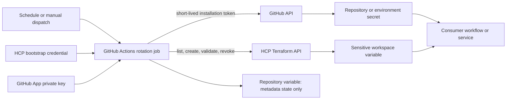
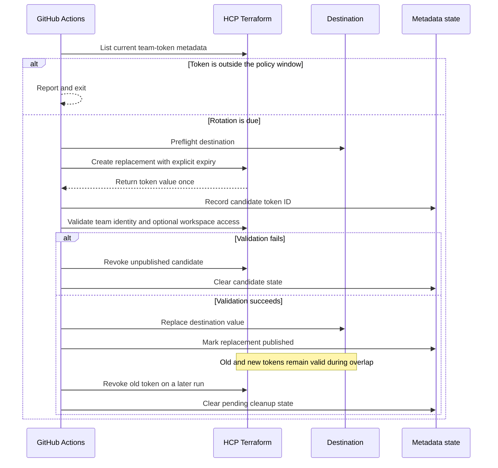

# HCP Terraform team-token rotator

[](https://github.com/fphilippon/hcp-terraform-tokens-rotator/actions/workflows/ci.yml)
[](LICENSE)

Rotate expiring HCP Terraform team tokens from GitHub Actions without introducing Vault. The workflow creates and validates a replacement, publishes it to its configured destination, retains the old token for a controlled overlap, and revokes the old token on a later run.

Supported destinations are:

- GitHub Actions repository secrets.
- GitHub Actions environment secrets.
- Existing sensitive HCP Terraform workspace variables.

The consumer-facing secret or variable name remains unchanged. The HCP Terraform replacement belongs to the same team but has a new token ID, value, description, and expiry.

> [!IMPORTANT]
> Use a private repository for production. Token values are never committed, but the configuration contains organization names, team IDs, workspace IDs, repository names, and rotation policy metadata.

## Contents

- [Architecture](#architecture)
- [Rotation lifecycle](#rotation-lifecycle)
- [Scope and constraints](#scope-and-constraints)
- [Prerequisites](#prerequisites)
- [Installation](#installation)
- [Operating model](#operating-model)
- [Troubleshooting](#troubleshooting)
- [Security and production-readiness checklist](#security-and-production-readiness-checklist)
- [Local validation](#local-validation)

## Architecture

The repository is the control plane. GitHub Actions provides scheduling and execution, a dedicated HCP Terraform bootstrap credential manages team tokens, and a GitHub App provides short-lived authorization for GitHub writes.



There are three deliberately separate credentials:

| Credential | Purpose | Storage |
|---|---|---|
| `HCP_TF_ROTATION_BOOTSTRAP` | Lists, creates, and revokes managed HCP team tokens; optionally updates workspace variables | GitHub Actions secret in the rotation repository |
| `GH_APP_PRIVATE_KEY` | Mints a short-lived GitHub App installation token | GitHub Actions secret in the rotation repository |
| Rotated team token | Workload credential delivered to its consumer | GitHub Actions secret or sensitive HCP workspace variable |

The bootstrap credential must not be the token being rotated. Losing or rotating the bootstrap credential requires a separate administrative recovery path.

## Rotation lifecycle



The workflow validates the new token's HCP identity and, when configured, read access to a representative workspace. It does not execute the downstream consumer's business operation. A real consumer test is required before the old token is revoked.

## Scope and constraints

- Uses the current multi-token HCP Terraform team-token API, which permits overlap.
- Supports one destination per managed token.
- Supports multiple targets in one configuration.
- GitHub destination repositories may differ from the rotation repository, but they must have the same GitHub owner.
- Stores only token IDs, timestamps, and lifecycle status in `HCP_TF_ROTATION_STATE`. This repository variable is not a secret store.
- Does not support user tokens, organization tokens, legacy single-token rotation, HCP Europe group tokens, GitHub organization secrets, HCP variable sets, multi-destination fan-out, or destinations under multiple GitHub owners.
- Requires a later scheduled or manual run for overlap cleanup; the runner does not wait for the overlap period.

Prefer one HCP team token per logical consumer. Sharing one token across unrelated repositories or workspaces increases blast radius and is not supported as an atomic fan-out operation by this implementation.

## Prerequisites

- An HCP Terraform organization using team tokens and the current multi-token API.
- A dedicated HCP Terraform bootstrap credential with permission to:
  - list the organization's team tokens;
  - create tokens for the configured teams;
  - revoke those tokens;
  - read and update destination workspace variables, when that destination type is used.
- A GitHub repository for this control plane. A private repository is recommended.
- Permission to create or use a GitHub App and install it on the rotation and destination repositories.
- GitHub CLI for the setup commands below.
- `curl` and `jq` if using the optional ID-discovery commands.

The target team must have the permissions needed by its consumer. If `validation_workspace_id` is configured, that team needs at least read access to the workspace. The **Members can manage** value on HCP Terraform's Team Tokens page controls token management; it does not grant workspace access.

## Installation

### 1. Clone the repository

```bash
git clone https://github.com/OWNER/hcp-terraform-tokens-rotator.git
cd hcp-terraform-tokens-rotator
```

Protect the default branch, require pull-request review for changes under `.github/`, `config/`, and `scripts/`, and restrict Actions administration to the platform-owning team.

### 2. Create the HCP Terraform bootstrap credential

Create a dedicated credential that can manage only the intended teams and workspace variables where practical. Give it an explicit expiry and an independently owned renewal procedure.

Store it in the rotation repository:

```bash
gh secret set HCP_TF_ROTATION_BOOTSTRAP \
  --repo OWNER/hcp-terraform-tokens-rotator
```

The CLI prompts for the value without placing it on the command line. Never place a token value in `targets.json`, a repository variable, workflow input, issue, pull request, or log.

### 3. Discover the required HCP IDs

HCP IDs are metadata, not token values. The configuration needs the current token ID so it can distinguish the managed token from other tokens belonging to the same team.

Read the bootstrap value without adding it to shell history:

```bash
printf "HCP Terraform bootstrap token: "
read -rs HCP_TF_ROTATION_BOOTSTRAP
printf "\n"
export HCP_TF_HOSTNAME="app.terraform.io"
export HCP_TF_ORGANIZATION="example-org"
```

List teams:

```bash
curl --fail-with-body --silent --show-error \
  --header "Authorization: Bearer ${HCP_TF_ROTATION_BOOTSTRAP}" \
  --header "Content-Type: application/vnd.api+json" \
  "https://${HCP_TF_HOSTNAME}/api/v2/organizations/${HCP_TF_ORGANIZATION}/teams" \
  | jq -r '.data[] | [.id, .attributes.name] | @tsv'
```

List current team-token IDs, descriptions, teams, and expiries:

```bash
curl --fail-with-body --silent --show-error \
  --header "Authorization: Bearer ${HCP_TF_ROTATION_BOOTSTRAP}" \
  --header "Content-Type: application/vnd.api+json" \
  "https://${HCP_TF_HOSTNAME}/api/v2/organizations/${HCP_TF_ORGANIZATION}/team-tokens?page%5Bsize%5D=100" \
  | jq -r '.data[] | [.id, .relationships.team.data.id, .attributes.description, .attributes["expired-at"]] | @tsv'
```

For a workspace-variable destination, list existing variables and identify the sensitive variable ID:

```bash
export HCP_TF_WORKSPACE_ID="ws-xxxxxxxx"

curl --fail-with-body --silent --show-error \
  --header "Authorization: Bearer ${HCP_TF_ROTATION_BOOTSTRAP}" \
  --header "Content-Type: application/vnd.api+json" \
  "https://${HCP_TF_HOSTNAME}/api/v2/workspaces/${HCP_TF_WORKSPACE_ID}/vars" \
  | jq -r '.data[] | [.id, .attributes.key, .attributes.category, .attributes.sensitive] | @tsv'
```

Clear the shell variable when finished:

```bash
unset HCP_TF_ROTATION_BOOTSTRAP
```

### 4. Register and install the GitHub App

Create a GitHub App owned by the repository owner, or make a personally owned App installable on the target organization.

Recommended registration settings:

- Webhooks: inactive.
- User authorization: disabled.
- Installation scope: **Only on this account** when the App owner also owns every repository; otherwise **Any account** and have the destination organization approve the installation.
- Repository permissions:
  - **Variables: read and write** for rotation state.
  - **Secrets: read and write** when a GitHub secret is a destination.
  - **Environments: read and write** when an environment secret is a destination.
- Organization permissions: none unless required by an external governance policy.

Install the App using **Only select repositories** and select:

1. The rotation repository.
2. Every repository containing a destination GitHub secret.

Generate a private key, then store the App credentials in the rotation repository:

```bash
gh variable set GH_APP_CLIENT_ID \
  --repo OWNER/hcp-terraform-tokens-rotator \
  --body "YOUR_CLIENT_ID"

gh secret set GH_APP_PRIVATE_KEY \
  --repo OWNER/hcp-terraform-tokens-rotator \
  < downloaded-private-key.pem
```

Explicitly scope the runtime installation token to the rotation repository and every GitHub destination repository:

```bash
gh variable set GH_APP_REPOSITORIES \
  --repo OWNER/hcp-terraform-tokens-rotator \
  --body "OWNER/hcp-terraform-tokens-rotator,OWNER/consumer-repository"
```

If `GH_APP_REPOSITORIES` is omitted, the runtime token is scoped to the rotation repository only. A `Token revoked` message in the GitHub App action's post-job step is expected: it refers to the short-lived GitHub installation token, not an HCP Terraform token.

### 5. Configure repository variables

| Name | Required | Value |
|---|---:|---|
| `GH_APP_CLIENT_ID` | For rotation | GitHub App client ID |
| `GH_APP_REPOSITORIES` | For cross-repository destinations | Comma- or newline-separated rotation and destination repositories |
| `HCP_TF_HOSTNAME` | No | Defaults to `app.terraform.io`; set for another HCP Terraform hostname |
| `HCP_ROTATION_ENABLED` | No during testing | Set to `true` only after the complete pilot succeeds |
| `HCP_TF_ROTATION_STATE` | Managed automatically | Rotation metadata; do not seed or edit during normal operation |

The scheduled job is intentionally disabled unless `HCP_ROTATION_ENABLED` equals `true`. Manual runs remain available.

### 6. Configure rotation targets

Copy [`config/targets.example.json`](config/targets.example.json) to [`config/targets.json`](config/targets.json), then define one target per token.

Repository secret example:

```json
{
  "state_variable": "HCP_TF_ROTATION_STATE",
  "targets": [
    {
      "name": "infra-production",
      "organization": "example-org",
      "team_id": "team-xxxxxxxx",
      "initial_token_id": "at-xxxxxxxx",
      "description_prefix": "github-actions/infra-production",
      "destination": {
        "type": "github_secret",
        "repository": "example-owner/infrastructure",
        "secret_name": "HCP_TF_TOKEN",
        "environment": "production"
      },
      "validation_workspace_id": "ws-xxxxxxxx",
      "rotate_before_days": 30,
      "new_token_lifetime_days": 90,
      "overlap_hours": 24
    }
  ]
}
```

Remove `environment` to update a repository secret. The destination repository may differ from the rotation repository as long as both have the same owner and are included in the App installation and `GH_APP_REPOSITORIES`.

Existing sensitive HCP workspace-variable example:

```json
"destination": {
  "type": "hcp_workspace_variable",
  "workspace_id": "ws-yyyyyyyy",
  "variable_id": "var-yyyyyyyy",
  "expected_key": "TFE_TOKEN"
}
```

The workspace variable must already exist and be marked sensitive. The script verifies its ID, sensitivity, and optional expected key, then patches only its value. It preserves the key, category, description, and sensitivity.

#### Target field reference

| Field | Required | Description |
|---|---:|---|
| `name` | Yes | Stable unique name used as the state key and log prefix |
| `organization` | Yes | HCP Terraform organization slug |
| `team_id` | Yes | Team that owns both the current and replacement tokens |
| `initial_token_id` | Yes | Current token ID used only until managed state records the first successful replacement |
| `description_prefix` | No | Prefix for unique replacement descriptions |
| `destination` | Yes | One `github_secret` or `hcp_workspace_variable` destination |
| `validation_workspace_id` | No, recommended | Workspace the new team token must be able to read before publication |
| `rotate_before_days` | No | Rotation window; defaults to 30 days |
| `new_token_lifetime_days` | No | Replacement lifetime; defaults to 90 days and must exceed the rotation window |
| `overlap_hours` | No | Minimum time both tokens remain active; defaults to 24 and must be at least 1 |

Do not manually change `initial_token_id` after successful rotations. `HCP_TF_ROTATION_STATE` becomes the source of truth for the current token ID.

### 7. Validate the installation

Run the workflow manually from the branch containing the implementation.

1. Run `mode: inventory`, `dry_run: true`.
   - Confirms bootstrap authentication and finds the configured token ID.
   - Performs no GitHub or HCP mutation.
2. Run `mode: rotate`, `dry_run: true`.
   - Confirms that rotation is due and preflights the destination.
   - Creates a short-lived GitHub App token but no HCP replacement.
3. Run `mode: rotate`, `dry_run: false` for a non-production pilot.
   - Creates and validates a replacement.
   - Publishes it to the destination.
   - Leaves the old token active until `revoke_after`.
4. Trigger a new consumer run and verify its real operation succeeds.
5. After `overlap_hours`, run `mode: rotate`, `dry_run: false` again.
   - Verifies the replacement and revokes the old token.
6. Confirm HCP Terraform shows only the replacement and the consumer still works.

Merge the tested workflow to the default branch before relying on scheduled execution. GitHub scheduled workflows run from the default branch.

### 8. Enable scheduled rotation

The supplied schedule runs daily at 06:17 UTC. Enable it only after the complete create, publish, consume, and cleanup cycle succeeds:

```bash
gh variable set HCP_ROTATION_ENABLED \
  --repo OWNER/hcp-terraform-tokens-rotator \
  --body "true"
```

Emergency stop:

```bash
gh variable set HCP_ROTATION_ENABLED \
  --repo OWNER/hcp-terraform-tokens-rotator \
  --body "false"
```

Disabling the schedule does not revoke or alter any HCP token. Manual inventory remains available.

## Operating model

### Workflow modes

| Mode | Dry run | Behavior |
|---|---:|---|
| `inventory` | Either | Lists configured token metadata and reports whether rotation is due; never mutates |
| `rotate` | `true` | Validates configuration and destination access, then reports intended actions |
| `rotate` | `false` | Creates and publishes due replacements or cleans up expired overlap state |

The repository-wide concurrency group prevents two workflow runs from mutating token state concurrently.

### State lifecycle

`HCP_TF_ROTATION_STATE` contains metadata only:

- Current token ID for each target.
- Old and replacement token IDs during overlap.
- Candidate description and timestamps.
- `candidate-created` or `published` lifecycle status.
- Time after which the old token may be revoked.

The candidate state is persisted before the secret value is published. This makes failures visible and prevents an automatic second replacement when publication is ambiguous.

### Failure behavior

| Failure | Automated behavior | Operator action |
|---|---|---|
| Inventory or configuration failure | No mutation | Correct hostname, organization, IDs, permissions, or configuration |
| Destination preflight failure | No replacement created | Correct GitHub App installation/permissions or workspace-variable metadata |
| Replacement validation failure | Candidate is revoked; destination and old token stay unchanged | Correct team/workspace access and retry |
| Candidate cleanup failure | Workflow fails with candidate state retained | Inspect HCP token inventory and reconcile before retrying |
| Destination publication or state update is ambiguous | Old token remains; future rotation is blocked | Test the consumer and follow the reconciliation procedure below |
| Old-token cleanup failure | Published state remains for retry | Correct permissions or API availability and rerun |

### Manual reconciliation

Do not delete `HCP_TF_ROTATION_STATE` merely to make the workflow pass. An unresolved `candidate-created` state may mean the destination was updated but final state persistence failed.

1. Disable scheduled rotation.
2. Record the old and candidate token IDs from `HCP_TF_ROTATION_STATE`.
3. Confirm both IDs in the HCP team-token inventory.
4. Test the consumer without exposing the destination value.
5. If publication is confirmed and the consumer works, reconcile the metadata to `published` under change control.
6. If publication cannot be confirmed, restore the destination to a known-good credential, verify the consumer, revoke the candidate, and remove only that target's pending state.
7. Run inventory and a dry-run rotation before re-enabling the schedule.

Keep an independently secured break-glass credential and documented ownership for this procedure.

## Troubleshooting

| Symptom | Likely cause | Resolution |
|---|---|---|
| HCP `GET organizations/.../team-tokens` returns `404` | Wrong organization/hostname, or a valid bootstrap token lacks permission | Confirm `HCP_TF_HOSTNAME`, organization slug, and bootstrap authorization; HCP may return `404` for forbidden resources |
| Configured `at-...` token is not found | Wrong, revoked, or stale `initial_token_id`; state may reference another token | Re-run metadata discovery and inspect `HCP_TF_ROTATION_STATE` before changing configuration |
| GitHub App action returns repository-installation `404` | App is not installed on that repository or the repository is outside the runtime token scope | Add the repository to the App installation and `GH_APP_REPOSITORIES` |
| Replacement validation gets workspace `404` | Wrong workspace ID or the target team lacks workspace/project access | Grant the team at least read access or select the correct validation workspace |
| Workspace variable preflight fails | Wrong variable ID/key, variable is not sensitive, or bootstrap lacks variable access | Correct the existing variable and configuration; do not create a replacement until preflight passes |
| Log says candidate was revoked | Validation failed before publication | The destination and old token remain unchanged; correct the cause and retry |
| Post-job log says `Token revoked` | Normal GitHub App cleanup | No action; this is the short-lived GitHub installation token |
| Node runtime or `punycode` warning | A pinned action still contains an older runtime dependency | Rotation can still succeed, but update and re-pin the affected official action after validation |

## Security and production-readiness checklist

- [ ] Repository is private and default-branch protection is enabled.
- [ ] CODEOWNERS or equivalent review covers workflow, script, and target configuration changes.
- [ ] Bootstrap credential is dedicated, least-privileged, expiring, and has a separate rotation owner.
- [ ] GitHub App is installed only on required repositories with only required permissions.
- [ ] GitHub App private keys have an owner, expiry/rotation process, and emergency revocation procedure.
- [ ] Production targets have a representative `validation_workspace_id` where applicable.
- [ ] `rotate_before_days`, token lifetime, and overlap comply with organizational policy.
- [ ] A real consumer test has succeeded during overlap.
- [ ] Workflow failures notify an owned incident or operations channel.
- [ ] GitHub and HCP audit logs are retained according to policy.
- [ ] The break-glass and ambiguous-publication runbooks have been tested.
- [ ] Third-party actions remain pinned to reviewed full commit SHAs and are periodically updated.

The workflow emits no built-in Slack, email, or incident-management notification. Configure GitHub Actions failure monitoring before production use.

## Local validation

The implementation uses Python's standard library and requires no runtime package installation.

```bash
python3 -m unittest discover -s tests -v
python3 -m py_compile scripts/rotate_hcp_team_tokens.py
python3 -m json.tool config/targets.example.json >/dev/null
```

## Repository layout

```text
.
├── .github/workflows/ci.yml
├── .github/workflows/rotate-hcp-team-tokens.yml
├── config/
│   ├── targets.example.json
│   └── targets.json
├── scripts/rotate_hcp_team_tokens.py
├── tests/test_rotate_hcp_team_tokens.py
└── README.md
```

## References

- [HCP Terraform API tokens](https://developer.hashicorp.com/terraform/cloud-docs/users-teams-organizations/api-tokens)
- [HCP Terraform team-token API](https://developer.hashicorp.com/terraform/enterprise/api-docs/team-tokens)
- [HCP Terraform workspace-variable API](https://developer.hashicorp.com/terraform/cloud-docs/api-docs/workspace-variables)
- [HCP Terraform team access](https://developer.hashicorp.com/terraform/cloud-docs/workspaces/settings/access)
- [Registering a GitHub App](https://docs.github.com/en/apps/creating-github-apps/registering-a-github-app)
- [Installing your own GitHub App](https://docs.github.com/en/apps/using-github-apps/installing-your-own-github-app)
- [GitHub Actions secrets API](https://docs.github.com/en/rest/actions/secrets)
- [`actions/create-github-app-token`](https://github.com/actions/create-github-app-token)
